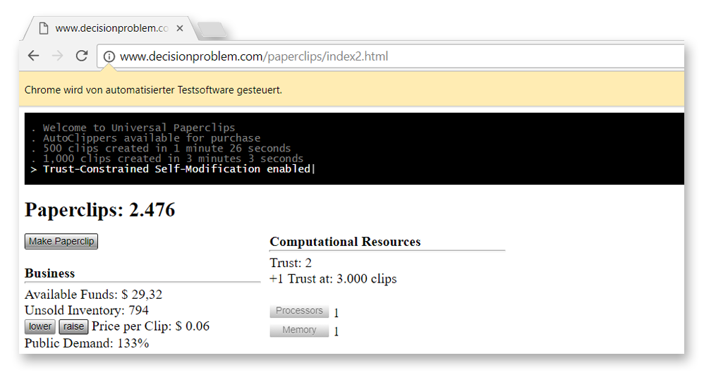

About
=====

This is a Selenium bot written in PHP playing the addictive [Universal Paperclips](http://www.decisionproblem.com/paperclips/index2.html) :paperclip: browser game.

Pre-Requisites
=====
- PHP
- Composer (https://getcomposer.org/)
- Selenium Server (http://www.seleniumhq.org/)

Installation
=====

Install package dependencies

     composer install
     
Configuration
=====
- configure `SELENIUM_HOST` in `config.php` in case it is not "http://localhost:4444". This selenium host should provide "chrome" browser(s).

Usage
=====
Start the bot:

     php start.php
     
Stop the bot by hitting "CTRL + C" or closing the browser window.
     
Info
=====
This bot is still a **beginner**.

This what he **can** do:

+ make paperclips
+ buy Autoclippers
+ buy new Wire when exceeded
+ lower/raise price according to production
+ buy marketing
+ buy memory
+ buy processor
+ buy technology

This is he **can't** do _yet_:

- play tournaments
- manage 2nd tech generation